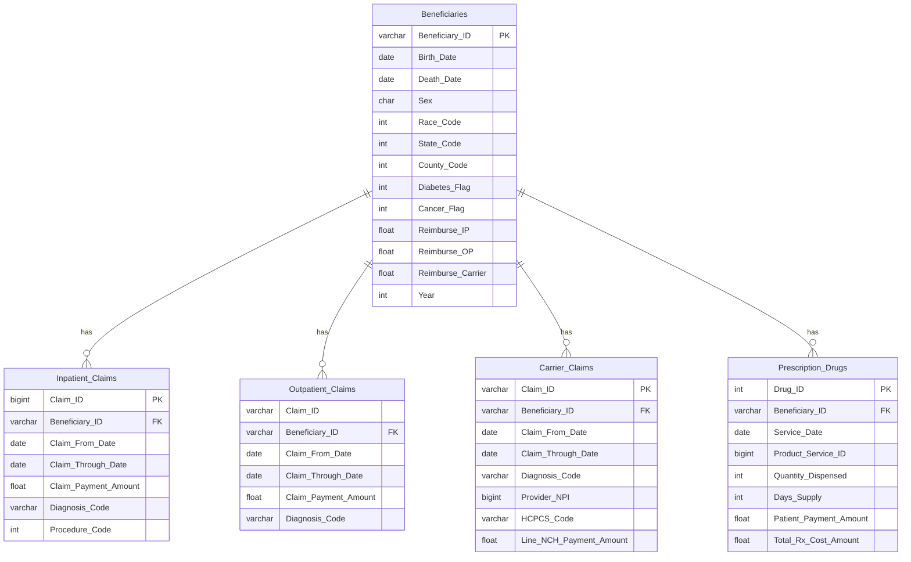

# Data Warehouse Schema

The project uses beneficiary records as the central entity connecting the main healthcare claim datasets.

## Conceptual Design

The original project was designed as a constellation-style healthcare warehouse. Inpatient and outpatient claims formed the primary analytical fact areas, while shared healthcare dimensions such as beneficiaries, providers, diagnosis codes, procedure codes, pharmacies, and medication events supported cross-functional analysis.

The SQL implementation in this repository focuses on the tables directly used in the project analysis and dashboard.

## Relationships

- A beneficiary can have multiple inpatient claims.
- A beneficiary can have multiple outpatient claims.
- A beneficiary can have multiple carrier claims.
- A beneficiary can have multiple prescription drug events.
- Claim-level diagnosis and procedure attributes support clinical and utilization analysis.
- Reimbursement fields in the beneficiary data support financial comparisons across claim categories.
